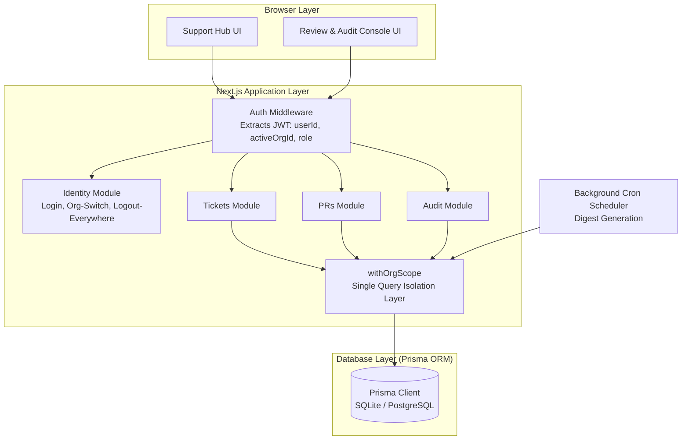

# System Architecture & Technical Design

## Overview

---

## Module Boundaries & Modular Design

Identity, Tickets, PR Workflows, and Audit Logging are implemented as modular domain services inside `/lib`:

- **Identity Module (`/lib/identity/`)**: Manages PBKDF2 password hashing, JWT creation, org switching, and global session revocation.
- **Query Scoping Engine (`/lib/authz/withOrgScope.ts`)**: Acts as the single choke-point for multi-tenant query isolation. No route handler constructs an un-scoped database query directly.
- **RBAC Policy Matrix (`/lib/authz/permissions.ts`)**: Central permission evaluator enforcing role boundaries across API handlers.
- **Audit Logger (`/lib/audit/audit.ts`)**: Append-only security logging for compliance audits.

---

## Service Extraction Architecture

To deploy Support Hub and Review & Audit Console as completely separate independent microservices:

1. **Identity Service**: Standalone microservice issuing RS256-signed JWTs, verified statelessly by downstream services using a public key.
2. **Dashboard Applications**: Separate Next.js apps deployed on independent subdomains sharing the parent cookie domain.
3. **Audit Service**: Dedicated event ingestion pipeline accepting append-only security logs.

---

## Tenant Isolation & BOLA Protection

All Ticket and PR database operations pass through `lib/authz/withOrgScope.ts`. This module enforces that:
- Every query automatically injects `where: { orgId: activeOrgId }`.
- Cross-tenant queries resolve only via explicit `TicketShare` or `PRShare` join records.
- Manipulated resource IDs across tenant boundaries return generic `404 Not Found` responses, preventing resource enumeration side-channels.

---

## Append-Only Audit Logging

Audit logs are strictly append-only. Mutation operations (`update`, `delete`) are prohibited on the `AuditLog` table. Every security-sensitive action (login, logout, org switch, connection approval, resource sharing) records a timestamped, structured audit record.

---

## AI Progress Digest Engine

The digest generator queries activity metrics strictly scoped to the requesting user's active organization and explicitly shared partner items. Each generated digest writes a `DIGEST_GENERATED` audit log containing traceable `sourceRefs`, verifying data provenance and preventing cross-tenant leaks.
