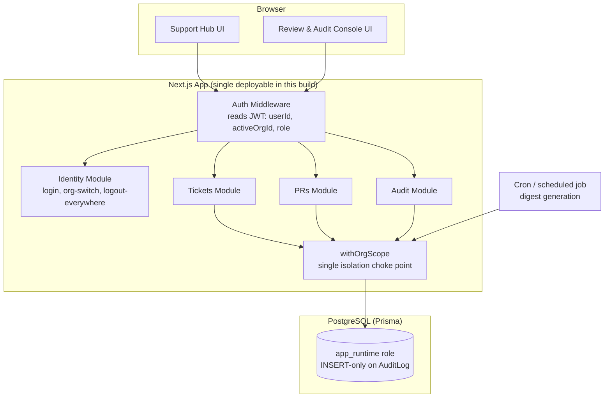

# Architecture

## Overview



## Why one deployable, not two services

The spec calls for "independently deployable" dashboards and a central
Identity/Org service both dashboards read from. For this build timeline,
Identity/Tickets/PRs/Audit are implemented as separate **modules within one
Next.js app** (see `/lib`), not separate services — but the module
boundaries are real: nothing outside `lib/authz` touches the Prisma client
for Ticket/PR reads or writes.

To actually split this into independently deployable services:
- Identity becomes its own service exposing a `/verify-token` and
  `/org-membership` endpoint (or issues JWTs the other two verify locally
  via a shared public key — preferred, avoids a sync call per request).
- Support Hub and Review & Audit Console become separate Next.js apps,
  each with their own Vercel project, sharing the cookie domain
  (`.yourapp.com`) and the JWT verification logic (published as a small
  internal package).
- Both continue to write to the same Postgres `AuditLog` table (or, at
  larger scale, the Audit module becomes its own service with a
  write-only API the other two call).

This is the first thing I'd change with another week — see
`/docs/decisions.md`.

## Tenant isolation

All Ticket/PR reads and writes go through `lib/authz/withOrgScope.ts`. This
is intentionally the **only** file that constructs a Prisma `where` clause
touching `orgId`. The BOLA test suite (`tests/isolation.test.ts`) asserts
that manipulated IDs across org boundaries return a generic not-found
response, never a 200 with data or a 403 that confirms existence.

## Append-only audit log

Enforced at the Postgres role level, not just in application code:

```sql
REVOKE UPDATE, DELETE ON "AuditLog" FROM app_runtime;
GRANT INSERT, SELECT ON "AuditLog" TO app_runtime;
```

The app connects as `app_runtime`. Migrations run under a separate
`app_migration` role with full DDL rights. This means even a fully
compromised app server cannot alter or delete audit history.

## AI digest scoping & traceability

The digest generator queries only `Ticket`/`PR` rows scoped to the
requesting user's `activeOrgId`, plus rows reachable via an unrevoked
`TicketShare`/`PRShare`. Every generated digest writes an `AuditLog` entry
of type `DIGEST_GENERATED` with `sourceRefs` listing exactly which
records were used — so a reviewer can verify what the AI output was
actually derived from, not just trust it. `tests/digest-leak.test.ts`
seeds a second org's private data and asserts it never appears in the
first org's digest output or its `sourceRefs`.
